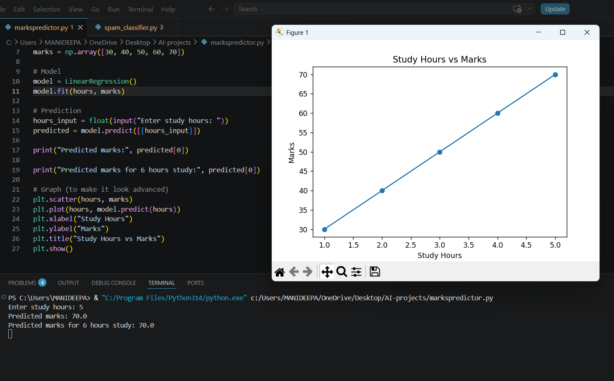
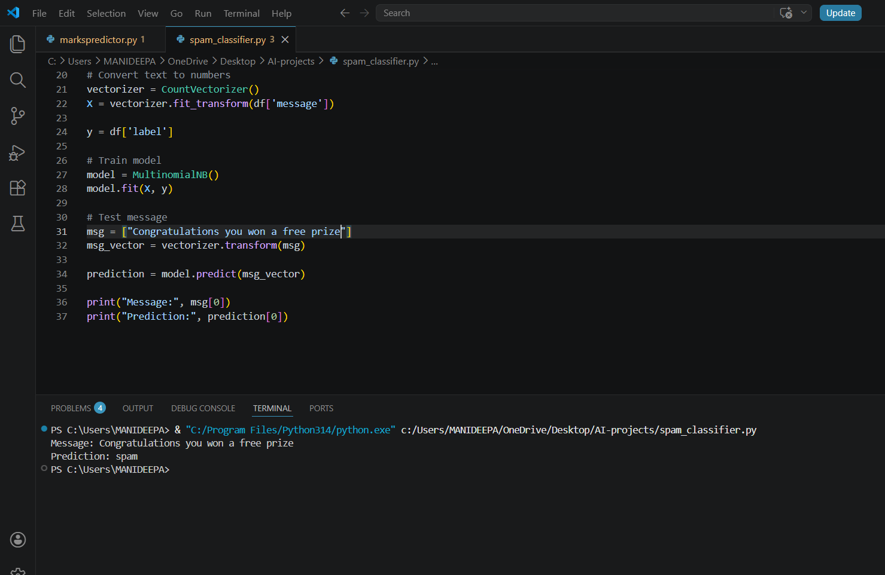
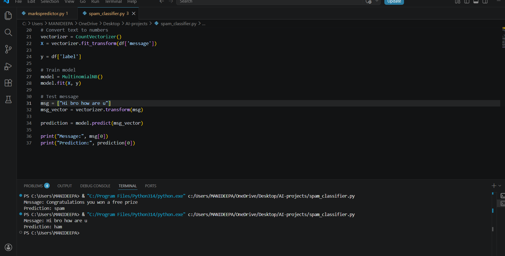

#  AI Mini Projects

This repository contains beginner-friendly Artificial Intelligence and Machine Learning projects built using Python.

##  Projects Included

###  1. Student Marks Predictor
- Predicts student marks based on study hours
- Uses Linear Regression algorithm
- Includes data visualization using Matplotlib

###  2. Spam Message Classifier
- Classifies messages as spam or not spam
- Uses Natural Language Processing (NLP)
- Implemented using CountVectorizer and Naive Bayes algorithm

##  Tools & Technologies
- Python
- NumPy
- Pandas
- Scikit-learn
- Matplotlib

##  Project Outputs

###  Marks Predictor

###  Spam Classifier

##  Purpose
These projects demonstrate basic understanding of machine learning concepts and real-world applications.

## Author
GitHub:https://github.com/Manideepa
